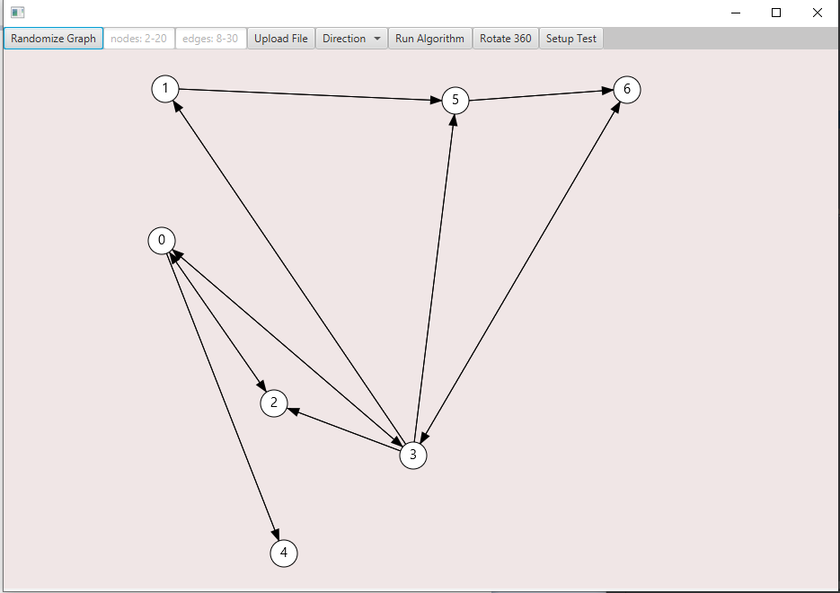

<h1>Graph Visualizer</h1>
<h2>This project is the basis for much more on the basis of a graph structure</h3>

<h2>Random graphs can be constructed:</h2>

<h2>Or they can have specific characteristics such as number of nodes and edges:</h2>

<h2>The syntax needed to create this directed graph is simple:</h2>

<h4>A: B C<h4>

A: denotes the source node and 'B C' denotes sink nodes that establishes the directional relationship.

In addition to that simple input, the undirected relationship within the graph is preserved.

<h2>This project has other features regarding graphs operations, but only dfs search at the moment:</h3>

<h4>Other operations would include actual graph manipulation such as transposing (reversing the graph's directions) and transitive closure (adding indirected edges/paths).</h4>

<h4>Aside from that, this is the basic graph structure that will be utilized for for any project.</h4>
<h2>Note: All (trignometric) mathematics involved were calculated from scratch.<h2>

<h1>Graph jar library</h2>
<h5>There is a basic-graph-lib.jar that was created out of this project whose edges and vertices contain Object values, but the jar is not found in this project (since it is essentially the models.graph folder.</h5>
<h5>The intention of this was to allow someone to easily input graph.addVertices("source-node-label", "sink-node-label"); and easily create both an undirectional and directional graph.</h5>
<h5>With this, the graph can easily have its Edge and Vertex values get injected with data to allow for further usage.<h5>
<h5>One such implementation is the Shape class I implemented to store an Object while having a visual representation of the Graph's edges and vertices.</h5>
<h5>This can allow for further encapsulation for, let's say, a canvas controller that paints the representation of the graph from the graph controller that calculates placement of the components, as well as a data injection controller.</h5>
<h5>These don't have to dependencies between each other, except that they reference the same graph while having different implementations (separation of concerns)</h5>
